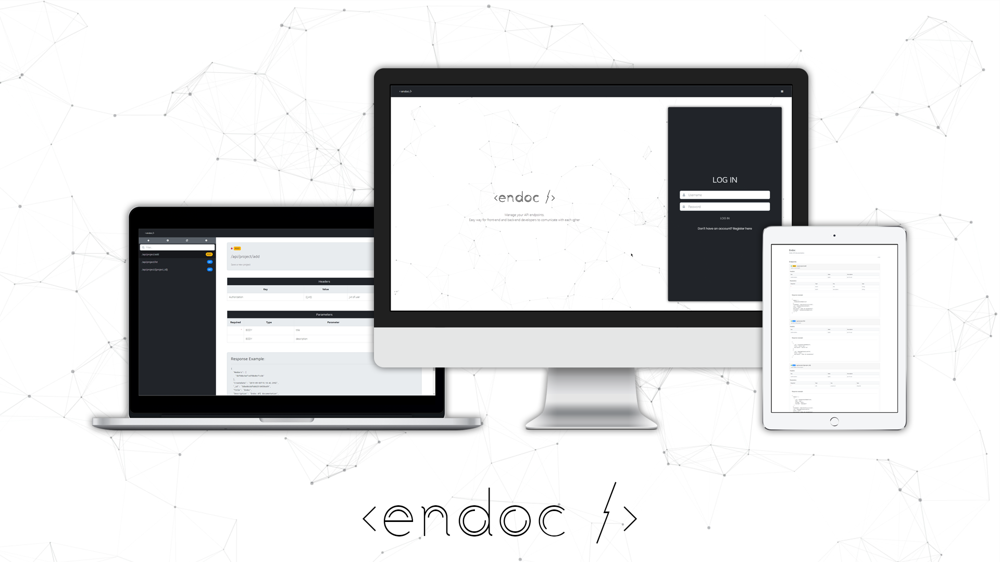

# endoc
**A free and open-source Endpoint Documentation tool**

**Built by Developers for Developers.**

---

*Note: This project is under heavy construction. As such, the API may change dramatically between major releases and documentation is lacking.*




## Instructions to run the application: 

1) Create a file on `/env` folder and name it `config.json`. Paste on this file the code below:

```JSON
{
  "Port": 3000,
  "DB": {
    "Mongo_ConStr": "<<YOUR_MONGODB_CON_STRING>>"
  },
  "JWT_SECRET": "<<YOUR_JWT_SECRET_KEY>>",
  "JWT_TIMEOUT": 86400
}
```

2) Navigate to `/client` folder to build Angular project. Run below command on your terminal: 
```Bash
ng build 
```

3) Navigate back to root folder and start node server using below command:

 ```Bash
node index.js
```

## Contact the developer: 


